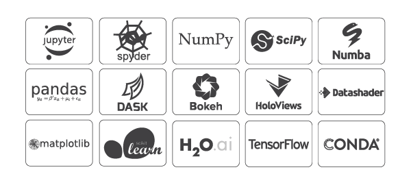
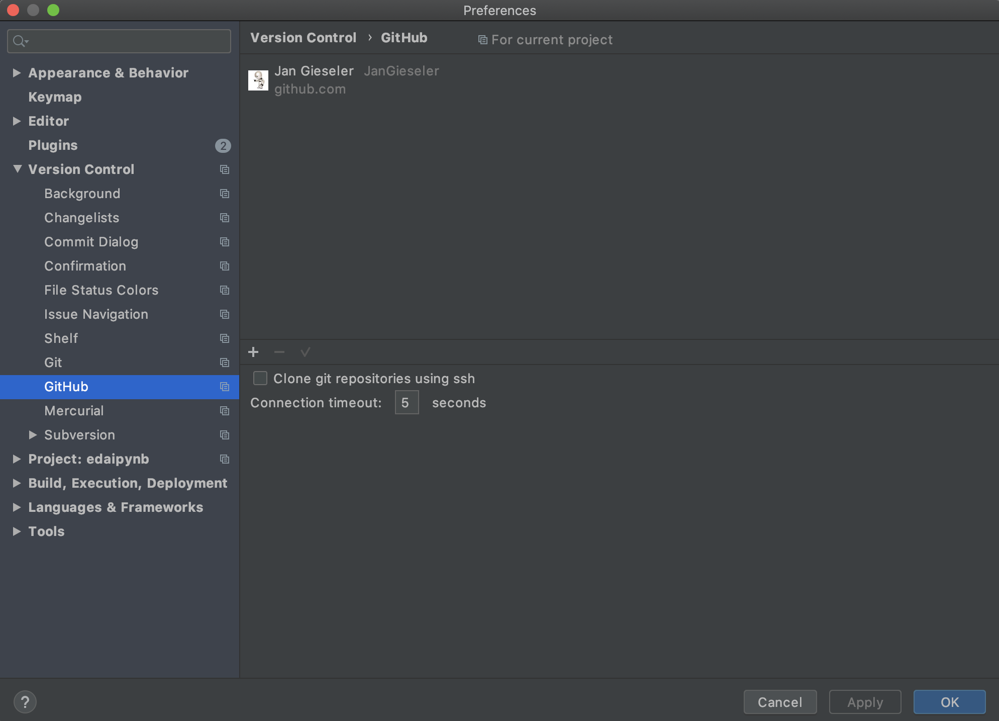

# edaipynb
edaipynb is an intro to 'Experimental Data Analysis with iPython Notebooks'

## A little motivation
The goal of these notes is to provide a concise guide towards using python and jupyter notebooks for experimental data analysis.
The main target audience is experimental physicist but the ideas here apply more generally.

[Python](https://www.python.org/) is a great tool free of charge that is widely used in academia and industry and therefore a useful skill for any scientist.
In experimental science on of the main challenges is to reconcile code redundancy, change in data structure and format and documentation of the results.


In the following we will use a combination of *python packages* to maintain low level code that can be maintained by and distributed to several collaborators and *jupyter notebooks* for highlevel code, clean representation of the results, and data exploration. 

 
## What you will learn
After reading through this file and going through the notebooks you will know
- How to setup a working environment (using Anaconda, PyCharm and Github)
- How to work with python packages, including
    - some basics of the Python language
    - package structure
    - version control with git (using github)
    - distribution of python packages (using pip)
    - accessing your python packages from jupyter notebooks
- How to work with jupyter notebooks, including
    - notebook extensions to extend the capabilities of your notebooks
    - organized and readable notebooks (using markdown, html and LaTex)
    - dynamically load your python packages
    - load and save data (using pandas)
    - plotting scientific figures 
    - interactive plotting for data analysis and exploration


## Before you get started - Setting up
Before we get going you need to install a few programs and setup you working environment
### Anaconda
I recommend to install python via Anaconda, which supports Linux, MacOS and Windows. Go to https://www.anaconda.com/distribution/ and install the latest version (Anaconda 2019.10 | Python 3.7 as of this writing).
This provides with python 3.7 and all the main python packages



### notebook extensions
[Jupyter Notebook Extensions](https://jupyter-contrib-nbextensions.readthedocs.io/en/latest/) contain unofficial extensions that add functionality to the Jupyter notebook.
<!--`pip install jupyter_contrib_nbextensions && jupyter contrib nbextension install `-->

In the anaconda shell or terminal execute

`conda install -c conda-forge jupyter_contrib_nbextensions`

and
 
`jupyter contrib nbextension install --sys-prefix`

to install the extensions.

Now we are ready to get going with Jupyter notebooks. If you also want to get into developing you own python packages follow the steps below to install PyCharm and setup a github account.
### PyCharm
Any text editor can be used to develop your python code. However, I find it more convinient to use an "integrated development environment" (IDE) such as PyCharm, which provided a range of useful tools. Go to https://www.jetbrains.com/pycharm/ and download the latest version of PyCharm.
### Github
[Version Control](https://git-scm.com/book/en/v2/Getting-Started-About-Version-Control)  is a system that records changes to a file or set of files over time so that you can recall specific versions later. Generally it means that if you screw things up or lose files, you can easily recover. In addition, you get all this for very little overhead.
As always there are many solutions out there. Here we will work with github. To create an account go to https://github.com/. To use github seamlessly with PyCharm go to `PyCharm->Preferences->Version Control->Github`. Then click on the '+' sign to login with your github credentials: 


<!--
## Getting Started
The software was developed and tested with python 3.6 on 64-bit Ubunutu. Prior to installation, install the latest  Anaconda distribution for python version 3.6, as it contains some extra dependencies this project utilizes.
You can find the latest Anaconda distribution [here](https://www.continuum.io/downloads). 

### Installation
There are two main ways to install edaipynb: via pip, the python package manager, or directly from the source via github. The former is easier, while the latter gives more explicit access to the source code.

#### Via pip (Beginner)
The simplest way to install edaipynb is with the command-line utility pip. To install simply issue the command

```>>> pip install git+https://github.com/JanGieseler/edaipynb.git```


#### Via git (Intermediate/Advanced)
If you are interested in hosting the source code more directly, you can clone from our git page:

```>>> git clone https://github.com/JanGieseler/edaipynb.git```

!-->


### Starting the notebook
From now on, we will switch to the jupyter notebooks.

There are two options to start up the notebook server.

Option 1 is to exectute `jupyter notebook` in the terminal or anaconda shell. The current location from which the command is executed will be the root location.

Option 2 is to open anaconda (in Windows) and start jupyter.


## Funding
edaipynb has been partially funded by the European Union (H2020-MSCA-IF-2014 under REA grant Agreement No. 655369).


# About
edaipynb is built on python 3.6 and tested on Ubunutu, MacOS and Windows
It was built by Jan Gieseler at ICFO. 
It is distributed under the [Revised BSD License](https://en.wikipedia.org/wiki/BSD_licenses).

# License

This software is released under a dual license; one of the following options can be chosen:

The [Revised BSD License](https://opensource.org/licenses/BSD-2-Clause) (© 2019, Jan Gieseler [JG]).
Any other license, as long as it is obtained from the creator of this package.

## FAQ
### pip install doesn't work
Make sure you have the latest version of pip and setuptools
```>>> pip install --upgrade setuptools```
```>>> pip install --upgrade pip```

